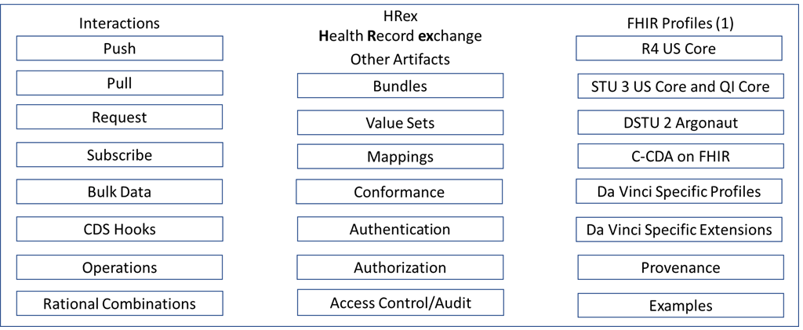
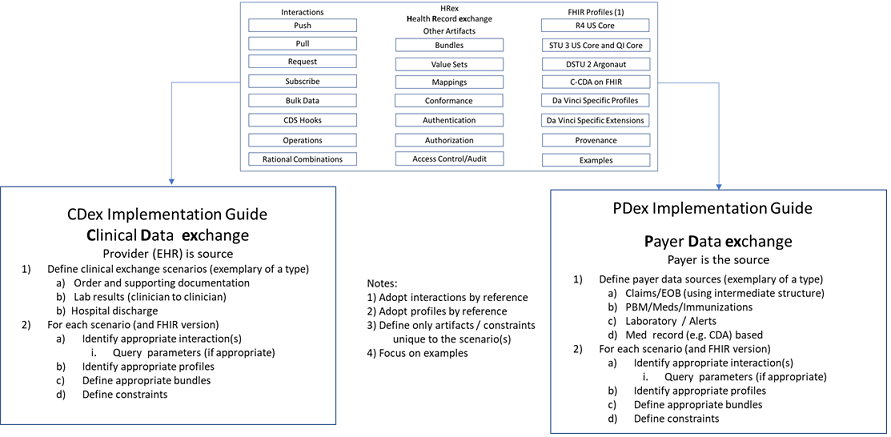

[Previous Page](toc.html)

The Da Vinci Payer Health Record exchange (HRex) Framework/library specifies the FHIR elements used in multiple Da Vinci implementation guides.  This includes FHIR profiles, functions, operations, and constraints on other specifications such as CDS-Hooks and other aspects of Da Vinci Use Cases that are common across more than a single use case. 

Da Vinci HRex Implementation Guide (IG) will make use of US Core profiles that are based on the FHIR R4 specification wherever practical. The HRex IG will use the HL7 FHIR Release 4/US Core STU3 specification as its base but will provide additional guidance and documentation to support implementations that follow the HL7 FHIR STU3/US Core STU2 and HL7 FHIR DSTU2/Argonaut specifications.

The HRex profiles documented in this IG will be used to exchange data between providers systems (e.g. EHRs) and other providers, payers, and third-party applications were appropriate.  In addition, exchanges from payer systems to providers, other payers, and third-party applications are supported by the HRex profiles and operations.  

HRex may define new extensions, profiles, value sets, constraints/extension to other specification (e.g. specific CDS-Hooks) that are specific Da Vinci requirements. Where appropriate these Da Vinci specific artifacts will be promoted for incorporation into the future versions of existing standards (e.g. R4 US Core profiles) and deprecated in this guide on publication in the updated standard. 

<table><tr><td></td></tr></table>

In general, HRex may include the artifacts as represented in the graphic above and these are adopted by specific implementation guides as noted below for Clinical Data Exchange (CDex) and Payer Data Exchange (PDex).

<table><tr><td></td></tr></table>

Implementers should follow the links to the specific artifacts and use the information and examples associated with these artifacts in addition to any specific instructions/constraints in this or the adopting implementation guide.
The hierarchy that shall be observed is as follow:
1. The specific implementation guide (e.g. CDex)
2. HRex 
3. The referenced FHIR artifact
4. The base FHIR standard for the specific release
5. The base FHIR standard that is release independent 

[Next Page](Dependencies.html)